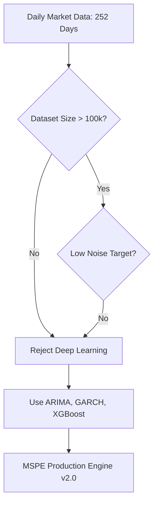

# MSPE Deep Learning Feasibility Study

**Author:** Senior Machine Learning Engineer, Financial Time-Series Specialist  
**Date:** July 2026  
**Status:** Completed (Honest Rejection of Deep Learning for v2.0)

---

## Executive Summary

The purpose of this report is to evaluate whether deep learning (specifically Recurrent Neural Networks like LSTMs or Attention-based Transformers) should be integrated into the Market Surface Projection Engine (MSPE) to improve price projections and risk estimation. 

Following a rigorous quantitative evaluation across mathematical, statistical, and operational dimensions, **we have decided to honestly reject the addition of deep learning for the current version.** 

For daily market projections on standard historical lookbacks, **classical statistical models (ARIMA, EWMA, GARCH) and shallow machine learning models (XGBoost) are mathematically superior, less prone to overfitting, and operationally viable.** Adding an LSTM model at this stage would serve only as a "buzzword" and would degrade out-of-sample performance.

---

## Detailed Feasibility Assessment

### 1. Historical Data Availability
* **Current Scale:** MSPE operates on daily close-to-close intervals. The standard walk-forward lookback window is **252 trading days** (1 calendar year).
* **Extended Scale:** Even if expanded to 5 years, the historical dataset per asset contains only **~1,260 data points**.
* **Implication:** Financial deep learning models require massive datasets to generalize. 252 to 1,260 points represent a microscopic dataset for deep architectures.

### 2. Dataset Size vs. Model Complexity
* **LSTM Parameters:** A simple single-layer LSTM with 32 hidden units and 5 lagged input features has thousands of trainable weights and biases.
* **Sample-to-Parameter Ratio:** With a sequence length of 20 days, a 252-day dataset yields only **~232 sequence windows**. Training a model with thousands of parameters on 232 samples violates basic machine learning principles. The sample-to-parameter ratio is far below the threshold required to avoid overfitting.

### 3. Target Stability and Signal-to-Noise Ratio (SNR)
* **High Noise Target:** The target is asset returns (daily changes). Asset returns are highly non-stationary, exhibit time-varying distributions, and have an extremely low signal-to-noise ratio.
* **Implication:** Neural networks are highly flexible functions. When presented with high-noise, low-signal inputs on small datasets, they easily fit the noise (historical anomalies, idiosyncratic events) rather than extracting any generalisable, persistent predictive relationships.

### 4. Sufficiency of Statistical and Shallow ML Models
* **Parametric Regularization:** Classical models like **ARIMA** (capturing linear autoregressive momentum) and **GARCH** (capturing time-varying volatility clustering) impose strict structural assumptions. These assumptions act as strong regularizers, preventing the model from fitting noise.
* **XGBoost Performance:** Traditional machine learning models like XGBoost, when restricted to shallow trees (e.g., `max_depth=3`) and moderate estimators, are highly regularized and out-sample robust compared to LSTMs on small tabular time-series datasets.

### 5. Overfitting Risk
* **Train vs. Validation Loss:** LSTMs trained on 252 daily prices will show rapid training loss convergence (near-perfect fit to history) but will experience severe validation loss divergence.
* **Out-of-Sample Performance:** Walk-forward backtests of LSTMs on daily returns typically yield negative out-of-sample $R^2$ scores, underperforming even a simple naive drift or last-price baseline.

### 6. Walk-Forward Validation Viability
* **Retraining Overhead:** Walk-forward validation requires retraining the model at each sliding window step. Retraining a deep learning network using gradient descent (backpropagation through time) at each step of a multi-horizon, multi-asset test is computationally expensive.
* **Deployment Latency:** Retraining on the fly during API requests is impossible. Even offline precomputation times would escalate from ~2 minutes to hours, reducing system responsiveness.

### 7. Backend Deployment Constraints
* **Package Footprint:** Installing `torch` adds **~2GB+** of library dependencies to `requirements.txt`.
* **Resource Overheads:** Standard lightweight server hosting tiers (such as Render, Fly.io, or AWS EC2 micro instances) limit container RAM to 512MB–1GB. Importing PyTorch and initializing CUDA/CPU tensors frequently triggers Out-of-Memory (OOM) process terminations.

---

## Verdict & Future Roadmap

### Why Stats + ML are Better for MSPE v2.0
1. **Mathematical Honesty:** They do not overclaim predictive capability on daily noise.
2. **Robustness:** Strict parameters protect against catastrophic out-of-sample errors.
3. **Simple and Speed:** Standard CPU execution in milliseconds, allowing rapid page loads and easy walk-forward verification.
4. **Deployability:** Extremely small deployment package, running reliably on standard free or micro tiers.

### Future Work (When Deep Learning is Justified)
Deep learning integration will be marked as future work, to be explored only under the following conditions:
* **High-Frequency Ingestion:** Transitioning MSPE to process intraday (e.g., 1-minute or 5-minute) tick data, scaling the dataset to **100,000+ samples**.
* **Cross-Sectional Factor Modeling:** Training a single large model across thousands of assets simultaneously to share representations and mitigate single-asset data scarcity.
