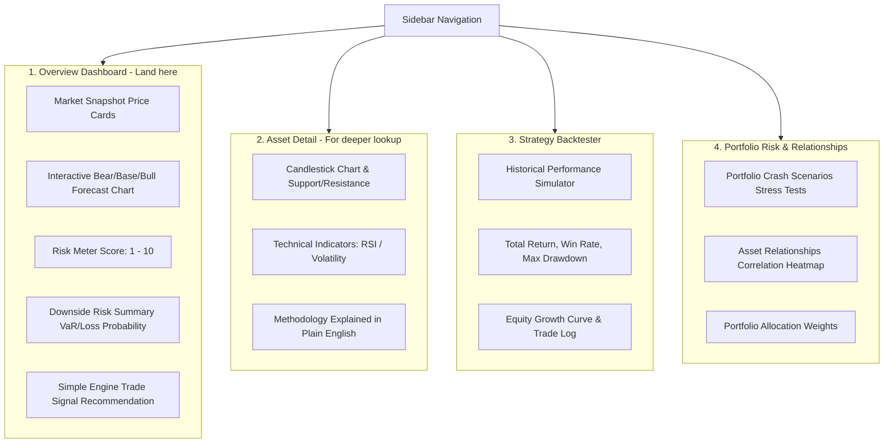

# Product Clarity Audit: Market Surface Projection Engine (MSPE)

This audit evaluates the positioning, vocabulary, architecture, and user journey of the MSPE project. It provides a concrete plan to transform MSPE from a jargon-heavy quantitative portal into an accessible, high-impact market projection and risk analytics dashboard.

---

## 1. What the Project Currently Says It Does

According to the existing [architecture docs](file:///c:/Desktop/MSPE_PR/docs/architecture/README.md) and [system files](file:///c:/Desktop/MSPE_PR/docs/architecture/01_REPOSITORY_STRUCTURE.md), MSPE claims to be an **institutional-grade quantitative finance platform** specializing in generating option-implied volatility surfaces and yield grids. Specifically, it claims to support:
*   **Low-Latency Streaming**: Streaming raw options chain ticks over TCP/WebSockets and optimized fit parameters directly to browsers.
*   **Mathematical Calibration**: Optimization models for **SVI (Stochastic Volatility Inspired)** and **SABR (Stochastic Alpha Beta Rho)** volatility surfaces.
*   **Scalable Infrastructure**: Celery distributed task worker pools and Redis queues to run resource-intensive Monte Carlo paths asynchronously.
*   **Risk Controls**: Dynamically updating Greeks (Delta, Gamma, Vega, Theta) and automated arbitrage scanners.

---

## 2. What the Project Actually Implements

A review of the active Python service classes in [backend/app/services](file:///c:/Desktop/MSPE_PR/backend/app/services/) and React components in [frontend/src/components](file:///c:/Desktop/MSPE_PR/frontend/src/components/) reveals a different, simpler set of core features:
*   **Core Math Layer ([backend/quant/](file:///c:/Desktop/MSPE_PR/backend/quant/))**:
    *   **ML Forecasting ([ml/](file:///c:/Desktop/MSPE_PR/backend/quant/ml/))**: Standard regression forecasters (ARIMA, GARCH, XGBoost, Random Forest, LSTM) that output next-day return and volatility predictions.
    *   **Risk Engine ([risk/analytics.py](file:///c:/Desktop/MSPE_PR/backend/quant/risk/analytics.py))**: Core calculations for historical and parametric Value at Risk (VaR), Conditional Value at Risk (CVaR/Expected Shortfall), volatility, drawdowns, Sharpe/Sortino ratios, benchmark sensitivity (Alpha/Beta), correlation, and static macro stress-testing.
    *   **Monte Carlo Simulator ([simulation/monte_carlo.py](file:///c:/Desktop/MSPE_PR/backend/quant/simulation/monte_carlo.py))**: Generates future asset prices based on Geometric Brownian Motion (using drift and volatility from the active ML forecasters) and calculates continuous probability density grids.
*   **Frontend Views ([frontend/src/components/](file:///c:/Desktop/MSPE_PR/frontend/src/components/))**:
    *   `MarketOverview.tsx`: Shows asset cards and engine/pipeline statuses.
    *   `AssetDashboard.tsx`: Displays interactive price candlestick plots with simple technical indicator overlays (SMA, EMA, Support, Resistance).
    *   `ProjectionSurface.tsx`: Triggers the Monte Carlo simulation and renders an interactive 3D density surface, plus 7-day Bull/Base/Bear projections.
    *   `SignalsBoard.tsx`: Visualizes strategy trades (LONG, SHORT) generated by combining machine learning drift with Monte Carlo percentile boundaries, tracked under a capital capacity limit.
    *   `BacktestResults.tsx`: Runs backtests of simple trend or mean-reversion strategies on historical data.
    *   `RiskProfiles.tsx` & `PortfolioRisk.tsx`: Compares individual assets and portfolio metrics (VaR, Sharpe, correlation, historical stress shocks).

> [!IMPORTANT]
> **Undocumented / Non-Existent Systems**: Option chains tick data, SVI/SABR volatility surface calibrations, Celery worker instances, Redis task queues, dynamic portfolio Greeks, and WebSockets do not exist in the codebase. All data is fetched via REST endpoints, and background tasks run within standard FastAPI background threads.

---

## 3. Confusing / Too Technical Elements

When a user or recruiter loads the portal, they are immediately hit with complex hedge-fund terminology and high cognitive overhead:
1.  **First Impression**: The landing page lists "Hedge Fund Quantitative Engine Pipeline", "Market Data Layer", "Strategic Forecasting", and active mathematical models ("XGBoost, GARCH, LSTM"). A recruiter cannot understand the purpose of the app from this description.
2.  **3D Projection Surface**: Renders a complex 3D surface plot where the Z-axis is "Probability Density". While visually impressive, density numbers (e.g. `0.0012`) are abstract and confusing without context.
3.  **Risk & Portfolio Analytics**: Pages are packed with math metrics like "Expected Shortfall (ES 95% / ES 99%)", "Jensen's Alpha", "Systemic Beta", and "Pearson product-moment returns correlation". These require advanced financial knowledge to interpret.
4.  **Complex Sidebar**: Navigation contains 7 distinct tabs. This creates choice fatigue and hides the most interesting aspects of the project.

---

## 4. Text & Vocabulary Simplification

To make the site clear to recruiters and general users, we must replace wall-street jargon with plain-english descriptions that explain *what* the metrics mean.

### Vocabulary Translation Dictionary

| Old Confusing Term | Problem | New Simple Label | Contextual Description (Tooltips/Labels) |
| :--- | :--- | :--- | :--- |
| **Market Overview** | Too generic | **Market Snapshot** | Current state of primary assets. |
| **Hedge Fund Quantitative Engine Pipeline** | Sounds like fake buzzwords | **Simulation Status** | Status of the background forecasting engine. |
| **Expected Shortfall (ES / CVaR)** | Confusing name | **Average Crash Loss** | The average expected loss in the worst 5% of market days. |
| **Value at Risk (VaR 95%)** | Relies on prior finance knowledge | **Maximum Daily Downside** | The maximum expected loss on a normal bad day (95% confidence). |
| **Jensen's Alpha** | Obscure quantitative metric | **Outperformance Score** | How much the asset beats its benchmark index after adjusting for risk. |
| **Beta (relative to SPX)** | Often misunderstood | **Market Sensitivity** | How volatile the asset is relative to the S&P 500 (e.g. 1.5x means it moves 50% more). |
| **Pearson returns correlation** | Too academic | **Asset Price Correlation** | Shows if assets move in the same direction or act as diversifiers. |
| **Euler-Maruyama step / Euler step** | High-level math terminology | **Time Horizon / Day step** | Number of days projected into the future. |
| **Probability Density Grid** | Abstract concept | **Interactive Probability Mesh** | Shows the likelihood of different future price points. |

---

## 5. Proposed Dashboard Restructuring

Instead of 7 scattered tabs, the application will be consolidated into **4 clear, user-focused pages**. The layout is designed to tell a clear product story in under 30 seconds.

---

## 6. Target User Journey (The 30-Second Hook)

When a recruiter opens the MSPE dashboard, the flow immediately answers three questions: *What is this?*, *What does it project for the future?*, and *What are the downside risks?*

1.  **Step 1: Welcome & Landing Page (0-5s)**:
    *   User sees a clean, modern header: **MSPE — Market Projection & Risk Engine**.
    *   Reads a one-line description: *"Instead of predicting one exact price, MSPE simulates 10,000 future paths to project a range of outcomes (Bear, Base, and Bull scenarios) and calculate downside risk."*
2.  **Step 2: Projections & Scenarios (5-15s)**:
    *   Sees the current price cards for BTC, ETH, SPX, Gold. Clicking on an asset updates the page.
    *   An interactive **Future Outlook** chart displays the next 7 days, mapping out the **Bull (P90)**, **Base (P50)**, and **Bear (P10)** trajectories.
3.  **Step 3: Downside Risk & Loss Likelihood (15-25s)**:
    *   Sees a colored **Risk Score (1-10)** (e.g. BTC: 8.5/10 High Risk, SPX: 3.2/10 Moderate Risk).
    *   Sees clear downside metrics:
        *   **Probability of Loss**: *"X% chance of dropping below current price over the next 7 days."*
        *   **Value at Risk (Worst-Case Day)**: *"95% confidence that any single-day drop will not exceed Y%."*
4.  **Step 4: Active Engine Signals (25-30s)**:
    *   Displays a simplified recommendation card: *"LONG (Buy suggestion) — The model is bullish with a target of $Z and a Stop-Loss fallback at $W."*
5.  **Step 5: Deeper Exploration (User Opt-in)**:
    *   User can click to open the **Asset Detail & Indicators** view for technical overlays (SMA, RSI) and read a simple breakdown of the underlying math (Monte Carlo, XGBoost, ARIMA).

---

## 7. Architecture Claim Reclassification

To ensure transparency for academic and professional reviews, any un-implemented institutional-grade features will be reclassified under a **Future Work & Scalability** section.

### 📋 Claims Reclassification Grid

| Unimplemented Claim in Old Docs | Code Reality | Reclassification Status |
| :--- | :--- | :--- |
| **Real-time TCP Option Chain feed Ingestion** | Only daily/hourly spot closes are ingested via Yahoo Finance / Binance. | **Future Work**: Add options data streaming adapters. |
| **Volatility Surface Calibration (SVI / SABR)** | Not in database schemas or service scripts. | **Future Work**: Fit option-implied volatility curves. |
| **Distributed Celery Execution Workers** | Calculations run locally in FastAPI background threads. | **Future Work**: Move heavy MC paths to distributed workers. |
| **Dynamic Portfolio Greeks & Hedging** | Greeks calculation classes and hedges do not exist. | **Future Work**: Add delta-hedging simulation algorithms. |

---

## 8. Implementation Roadmap

The restructuring will be completed in 4 focused phases, without altering the core quantitative models.

### Phase 1: Sidebar & Overview Dashboard Consolidation
*   Modify `Sidebar.tsx` to display 4 tabs: **Market Projections**, **Technical Detail**, **Strategy Backtester**, and **Portfolio Risks**.
*   Restructure `MarketOverview.tsx` to act as the primary landing page:
    *   Move the asset selection logic to the landing page.
    *   Combine current price cards with a 7-day Bear/Base/Bull line chart.
    *   Display simple risk and probability widgets.

### Phase 2: User Interface Simplification & Explanations
*   Incorporate tooltips and plain-english labels for all complex metrics (e.g. Sharpe, Sortino, VaR, CVaR, Alpha, Beta).
*   Add a **How it Works** explanation section to the bottom of the Asset Detail page.

### Phase 3: Detail Views & Portfolios Integration
*   Consolidate `AssetDashboard.tsx` and `ProjectionSurface.tsx` into a single **Technical Detail** tab. Add a toggle to show/hide the 3D surface plot.
*   Merge `RiskProfiles.tsx` and `PortfolioRisk.tsx` into the **Portfolio Risks** tab to keep all risk analyses centralized.

### Phase 4: Strategy Backtester Polish
*   Clean up `BacktestResults.tsx` to highlight simplified trade statistics.
*   Verify that all backend endpoints support the consolidated page structures.
