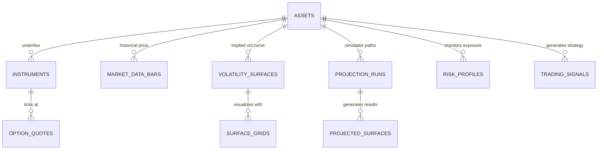

# Database Schema & Relational Architecture

This document defines the production-grade PostgreSQL relational schema for the **Market Surface Projection Engine (MSPE)**. The design uses relational schemas optimized for high-dimensional options chains, volatility parameters, simulation outputs, and trading signals, including declarative partitioning for time-series scalability.

---

## 1. Entity-Relationship Conceptual Model



---

## 2. Table Definitions & DDL Specifications

### 2.1 Core Asset Directories

#### Table: `assets`
Contains underlying assets (indices, equities, commodities, cryptocurrencies).

```sql
CREATE TABLE assets (
    id UUID PRIMARY KEY DEFAULT gen_random_uuid(),
    ticker VARCHAR(24) NOT NULL UNIQUE,
    name VARCHAR(255) NOT NULL,
    asset_class VARCHAR(64) NOT NULL, -- e.g., 'EQUITY', 'INDEX', 'CRYPTO'
    is_active BOOLEAN NOT NULL DEFAULT TRUE,
    created_at TIMESTAMPTZ NOT NULL DEFAULT NOW(),
    updated_at TIMESTAMPTZ NOT NULL DEFAULT NOW()
);

CREATE INDEX idx_assets_class ON assets(asset_class);
```

#### Table: `instruments`
Option contracts linked to an underlying asset.

```sql
CREATE TABLE instruments (
    id UUID PRIMARY KEY DEFAULT gen_random_uuid(),
    asset_id UUID NOT NULL REFERENCES assets(id) ON DELETE RESTRICT,
    symbol VARCHAR(64) NOT NULL UNIQUE, -- e.g., 'SPXW260619C05000000'
    option_type CHAR(1) NOT NULL CHECK (option_type IN ('C', 'P')), -- C = Call, P = Put
    strike NUMERIC(18, 4) NOT NULL,
    expiration_date TIMESTAMPTZ NOT NULL,
    contract_size NUMERIC(10, 2) NOT NULL DEFAULT 100.0,
    created_at TIMESTAMPTZ NOT NULL DEFAULT NOW()
);

CREATE INDEX idx_instruments_asset_expiry ON instruments(asset_id, expiration_date);
CREATE INDEX idx_instruments_strike_type ON instruments(strike, option_type);
```

---

### 2.2 Time-Series Market Feeds (Partitioned Tables)

High-frequency time-series tables are partitioned by **monthly ranges** to guarantee rapid query execution on historical data.

#### Table: `market_bars`
High-resolution tick/bar charts of the underlying spot assets.

```sql
CREATE TABLE market_bars (
    timestamp TIMESTAMPTZ NOT NULL,
    asset_id UUID NOT NULL REFERENCES assets(id) ON DELETE RESTRICT,
    open NUMERIC(18, 6) NOT NULL,
    high NUMERIC(18, 6) NOT NULL,
    low NUMERIC(18, 6) NOT NULL,
    close NUMERIC(18, 6) NOT NULL,
    volume NUMERIC(24, 6) NOT NULL,
    resolution VARCHAR(8) NOT NULL, -- '1m', '5m', '1h', '1d'
    PRIMARY KEY (asset_id, resolution, timestamp)
) PARTITION BY RANGE (timestamp);

-- Example Partition Creation Syntax (Automated in Alembic / pg_partman)
-- CREATE TABLE market_bars_y2026m06 PARTITION OF market_bars FOR VALUES FROM ('2026-06-01 00:00:00+00') TO ('2026-07-01 00:00:00+00');
```

#### Table: `option_quotes`
Real-time snapshots of the options chain bid/ask spreads, open interest, and implied volatility.

```sql
CREATE TABLE option_quotes (
    timestamp TIMESTAMPTZ NOT NULL,
    instrument_id UUID NOT NULL REFERENCES instruments(id) ON DELETE RESTRICT,
    bid NUMERIC(18, 6) NOT NULL,
    ask NUMERIC(18, 6) NOT NULL,
    last NUMERIC(18, 6) NOT NULL,
    volume NUMERIC(18, 6) NOT NULL,
    open_interest NUMERIC(18, 6) NOT NULL,
    underlying_price NUMERIC(18, 6) NOT NULL,
    implied_volatility NUMERIC(10, 6) NOT NULL, -- Option implied vol
    PRIMARY KEY (instrument_id, timestamp)
) PARTITION BY RANGE (timestamp);

CREATE INDEX idx_opt_quotes_time_iv ON option_quotes (timestamp, implied_volatility);
```

---

### 2.3 Mathematical Calibration (Volatility Surfaces)

#### Table: `volatility_surfaces`
Stores fitted mathematical model parameters describing the global volatility surface structure at specific points in time.

```sql
CREATE TABLE volatility_surfaces (
    id UUID PRIMARY KEY DEFAULT gen_random_uuid(),
    asset_id UUID NOT NULL REFERENCES assets(id) ON DELETE CASCADE,
    timestamp TIMESTAMPTZ NOT NULL,
    model_type VARCHAR(32) NOT NULL, -- 'SVI', 'SABR', 'HESTON', 'DUPIRE_LOCAL'
    parameters JSONB NOT NULL,       -- SVI: {a, b, rho, m, sigma}, SABR: {alpha, beta, rho, nu}
    calibration_error NUMERIC(12, 8) NOT NULL, -- Root Mean Squared Error (RMSE) against market IVs
    is_valid BOOLEAN NOT NULL DEFAULT TRUE,
    created_at TIMESTAMPTZ NOT NULL DEFAULT NOW()
);

CREATE INDEX idx_vol_surfaces_lookup ON volatility_surfaces (asset_id, timestamp DESC);
```

#### Table: `surface_grids`
Stores dense grid slices (strike-tenor coordinates) extrapolated from fitted models, optimized for real-time WebGL rendering and quick math operations.

```sql
CREATE TABLE surface_grids (
    id UUID PRIMARY KEY DEFAULT gen_random_uuid(),
    surface_id UUID NOT NULL REFERENCES volatility_surfaces(id) ON DELETE CASCADE,
    strike NUMERIC(18, 4) NOT NULL,
    tenor NUMERIC(8, 4) NOT NULL,      -- Expiry in years, e.g., 0.25 (3M), 1.00 (1Y)
    implied_volatility NUMERIC(10, 6) NOT NULL,
    local_volatility NUMERIC(10, 6) NOT NULL,
    delta NUMERIC(8, 4) NOT NULL        -- Standardized strike delta (e.g., -0.50 for ATM Put)
);

CREATE INDEX idx_surface_grids_lookup ON surface_grids (surface_id, tenor, strike);
```

---

### 2.4 Simulation Engine (Monte Carlo & Projections)

#### Table: `projection_runs`
Logs execution metadata for ML and Monte Carlo runs.

```sql
CREATE TABLE projection_runs (
    id UUID PRIMARY KEY DEFAULT gen_random_uuid(),
    asset_id UUID NOT NULL REFERENCES assets(id) ON DELETE CASCADE,
    timestamp TIMESTAMPTZ NOT NULL DEFAULT NOW(),
    parameters JSONB NOT NULL,       -- {num_paths: 100000, time_steps: 252, drift_model: 'LSTM_PyTorch'}
    status VARCHAR(32) NOT NULL,     -- 'PENDING', 'RUNNING', 'COMPLETED', 'FAILED'
    execution_duration NUMERIC(10, 2), -- In seconds
    error_message TEXT,
    created_at TIMESTAMPTZ NOT NULL DEFAULT NOW()
);

CREATE INDEX idx_proj_runs_asset ON projection_runs (asset_id, timestamp DESC);
```

#### Table: `projected_surfaces`
Output results of Monte Carlo path projections. This captures probabilistic surface bounds.

```sql
CREATE TABLE projected_surfaces (
    id UUID PRIMARY KEY DEFAULT gen_random_uuid(),
    run_id UUID NOT NULL REFERENCES projection_runs(id) ON DELETE CASCADE,
    projection_date TIMESTAMPTZ NOT NULL, -- Target future date in the simulation path
    strike NUMERIC(18, 4) NOT NULL,
    tenor NUMERIC(8, 4) NOT NULL,
    vol_p10 NUMERIC(10, 6) NOT NULL, -- 10th percentile bound
    vol_p50 NUMERIC(10, 6) NOT NULL, -- Median projection
    vol_p90 NUMERIC(10, 6) NOT NULL, -- 90th percentile bound
    density NUMERIC(12, 8) NOT NULL   -- Probabilistic joint density at this coordinate
);

CREATE INDEX idx_proj_surfaces_run ON projected_surfaces (run_id, projection_date);
```

---

### 2.5 Portfolio Risk & Trading Signals

#### Table: `risk_profiles`
Real-time/historical Greek configurations and risk parameters.

```sql
CREATE TABLE risk_profiles (
    id UUID PRIMARY KEY DEFAULT gen_random_uuid(),
    asset_id UUID NOT NULL REFERENCES assets(id) ON DELETE CASCADE,
    timestamp TIMESTAMPTZ NOT NULL,
    delta NUMERIC(18, 4) NOT NULL,
    gamma NUMERIC(18, 4) NOT NULL,
    vega NUMERIC(18, 4) NOT NULL,
    theta NUMERIC(18, 4) NOT NULL,
    vanna NUMERIC(18, 4) NOT NULL,
    volga NUMERIC(18, 4) NOT NULL,
    value_at_risk_95 NUMERIC(18, 4) NOT NULL, -- 95% 1-day VaR
    cvar_95 NUMERIC(18, 4) NOT NULL,          -- 95% Conditional VaR
    stress_scenarios JSONB NOT NULL,           -- Results of custom macro scenario stress tests
    created_at TIMESTAMPTZ NOT NULL DEFAULT NOW()
);

CREATE INDEX idx_risk_profiles_lookup ON risk_profiles (asset_id, timestamp DESC);
```

#### Table: `trading_signals`
Output of option strategy models (dispersion trading, volatility arbitrage, systematic option writing).

```sql
CREATE TABLE trading_signals (
    id UUID PRIMARY KEY DEFAULT gen_random_uuid(),
    asset_id UUID NOT NULL REFERENCES assets(id) ON DELETE CASCADE,
    timestamp TIMESTAMPTZ NOT NULL,
    strategy_name VARCHAR(64) NOT NULL,     -- 'VOL_ARBITRAGE', 'SKEW_DISPERSION', 'DELTA_NEUTRAL'
    signal_type VARCHAR(16) NOT NULL,       -- 'BUY_SKEW', 'SELL_SKEW', 'LONG_VOL', 'SHORT_VOL'
    confidence_score NUMERIC(5, 4) NOT NULL,  -- Scale of 0.0000 to 1.0000
    entry_strike NUMERIC(18, 4),
    entry_tenor NUMERIC(8, 4),
    signal_details JSONB NOT NULL,          -- Entry metrics, hedge ratios, and dynamic stop loss rules
    is_executed BOOLEAN NOT NULL DEFAULT FALSE,
    created_at TIMESTAMPTZ NOT NULL DEFAULT NOW()
);

CREATE INDEX idx_trading_signals_lookup ON trading_signals (strategy_name, timestamp DESC);
```

---

## 3. Database Security & Scaling Strategy

1.  **Read/Write Splitting**: 
    The heavy volumetric tick tables (`market_bars` and `option_quotes`) are isolated to a read-replica database instance. Fast-fitted surface results, risk metrics, and trade signals are kept on the primary database cluster.
2.  **Row-Level Security (RLS)**:
    All tables use Row-Level Security policies inside Supabase to restrict frontend clients from directly editing schema elements or reading trade signals unless properly authenticated as the trading user role.
3.  **TimescaleDB Optimization** (Optional):
    For production scale, `market_bars` and `option_quotes` can be converted to TimescaleDB **Hyper-tables** to improve compression rates (up to 90%) and accelerate time-series rollups.
