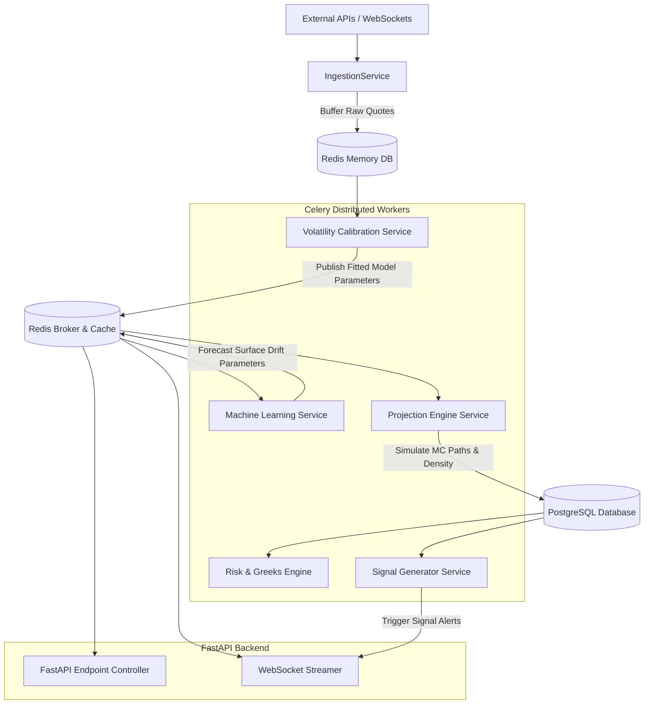

# Service Architecture & Processing Topology

This document details the backend service boundaries, decoupled workers, event broker strategies, and caching patterns for the **Market Surface Projection Engine (MSPE)**. High-frequency quantitative modeling requires isolating low-latency streaming paths from heavy numerical simulations.

---

## 1. Modular Service Architecture

The system consists of six dedicated services coordinating through a PostgreSQL primary store and a Redis memory cluster.



---

## 2. Detailed Service Responsibilities

### 2.1 Ingestion Service (`IngestionService`)
*   **Role**: Subscribes to institutional data feeds (e.g., Interactive Brokers, Kaiko, Polygon.io) for live underlying asset spot feeds and raw option chains (bids, asks, sizes, strikes, expirations).
*   **Execution**: Multi-threaded async python process that pushes raw quote updates into a circular Redis sliding-window list buffer. It bypasses the relational database for raw ticks to prevent database write bottlenecks.

### 2.2 Volatility Calibration Service (`VolatilityCalibrationService`)
*   **Role**: Periodically (e.g., every 15 seconds) pulls raw option quotes from the Redis buffer and fits them to parametric volatility models (SVI, SABR) and numerically converts implied surface bounds to Dupire Local Volatility grids.
*   **Algorithms**: Uses the custom library in `backend/quant/volatility/` utilizing scipy-based optimization.
*   **Caching**: Publishes fitted parameter vectors to a Redis Pub/Sub topic and updates the latest surface state inside the primary cache.

### 2.3 Machine Learning Service (`MachineLearningService`)
*   **Role**: Performs inferences to predict how the volatility surface will drift or morph over a forward-looking horizon (1 day to 1 month).
*   **Frameworks**: PyTorch (LSTM/Transformers) and XGBoost.
*   **Data Processing**: Standardizes historical 2D surface matrices into 1D parameter vectors, performs forward inference, and outputs anticipated parameter shifts.

### 2.4 Projection Engine Service (`ProjectionEngineService`)
*   **Role**: Performs CPU/GPU accelerated Monte Carlo simulations over a specified future horizon to generate probabilistic paths of volatility structures.
*   **Execution**: Spawns long-running distributed simulation workers. Generates simulated asset price arrays under a joint risk-neutral/physical distribution using stochastic volatility paths (Heston / SABR).
*   **Outcome**: Generates future multi-dimensional surface maps containing median expectations and statistical percentiles (10th/50th/90th percentile surfaces).

### 2.5 Risk Engine Service (`RiskEngineService`)
*   **Role**: Computes aggregate portfolio-level Greeks (Delta, Gamma, Vega, Theta) and high-dimensional cross-Greeks (Vanna, Volga).
*   **Calculations**: Implements analytical formulations for vanilla options and runs grid-based finite-difference simulations for portfolios of complex barrier/exotic structures against the projected surface sheets.
*   **Stress Testing**: Performs shock scenarios (e.g., Spot price +/- 15%, Implied Volatility +/- 50%) to compile Value at Risk (VaR) and CVaR.

### 2.6 Signal Generator Service (`SignalGeneratorService`)
*   **Role**: Monitors fitted surfaces, projected distributions, and real-time quotes to generate trade recommendations.
*   **Strategies**:
    *   *Volatility Arbitrage*: Spotting non-parallel surface shifts and calendar/butterfly arbitrage breaches.
    *   *Dispersion Trading*: Analyzing stock-index component volatility versus index volatility.
    *   *Delta-Neutral Market Making*: Continuous option portfolio rebalancing.

---

## 3. Celery Task Queueing Architecture

To manage CPU/GPU resources, tasks are routed to specific Redis-backed queues:

| Queue Name | Priority | Max Latency | Target Computational Node | Example Tasks |
| :--- | :--- | :--- | :--- | :--- |
| `realtime_fit` | **CRITICAL** | < 2s | High-frequency CPU cores | Re-calibrating SPX/BTC SVI surface parameters. |
| `risk_stress` | **HIGH** | < 5s | Multi-threaded CPU nodes | Re-evaluating portfolio Greeks and executing stress tests. |
| `monte_carlo` | **MEDIUM** | < 30s | GPU instances / CUDA cores | Generating 100,000 asset paths using PyTorch simulators. |
| `data_cleanup` | **LOW** | < 1 hour | Standard CPU node | Aggregating tick data into hourly/daily SQL bars. |

---

## 4. Cache Key Topology (Redis)

Redis is deployed as a high-performance key-value store and event broker:

```text
# Latest spot market data for assets
mspe:asset:<ticker>:latest             -> Hash { "price": 5050.25, "timestamp": "2026-06-01T12:00:00Z" }

# Calibrated volatility surface parameters
mspe:surface:<ticker>:<model_type>     -> Hash { "a": 0.04, "b": 0.12, "rho": -0.45, "rmse": 0.0014 }

# Compressed binary representation of the dense 3D surface mesh
mspe:surface:grid:<ticker>:latest      -> Float Array / String (Serialized Protocol Buffers)

# Status indicators of active Monte Carlo simulation runs
mspe:jobs:status:<run_id>             -> String ("PENDING" | "RUNNING" | "COMPLETED")
```
*   **Eviction Policy**: `volatile-lru` (Least Recently Used with TTL) is set for real-time volatility grids to ensure raw quote buffers are purged once processed.
*   **Broker Mode**: Redis Pub/Sub channels push fresh fitted coordinates instantly to Next.js clients over WebSockets.
