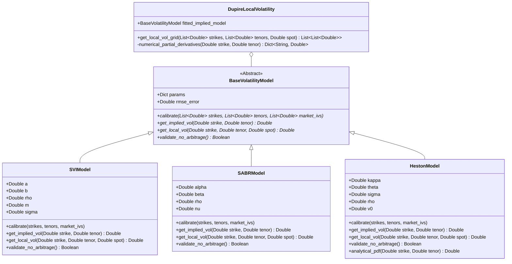
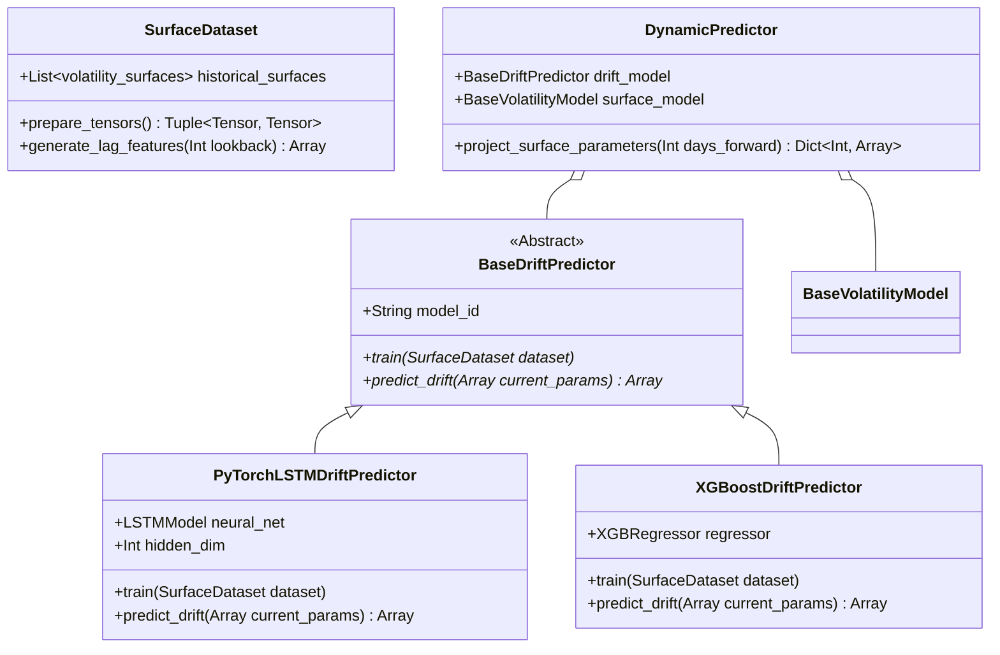
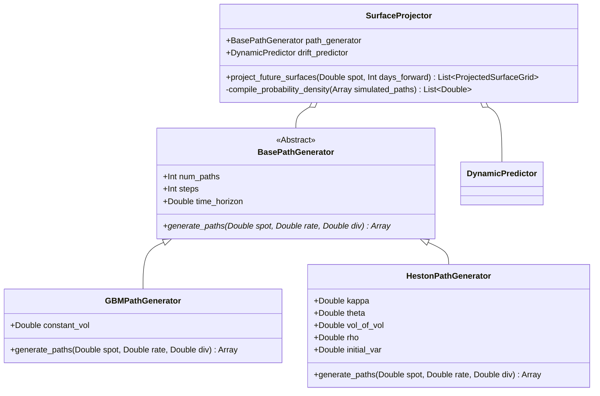
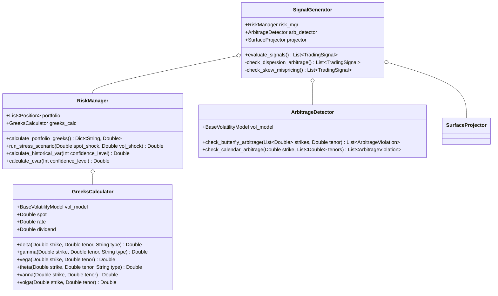

# Class Diagrams & OO Design Specifications

This document defines the Object-Oriented design contracts for the **Market Surface Projection Engine (MSPE)** quantitative library (`backend/quant/`). 

These classes are written in pure Python, maintaining complete separation from the FastAPI framework and database layers to facilitate modular unit testing and future high-performance rewrites.

---

## 1. Volatility Models Architecture

Defines the mathematical interface for fitting and extrapolating implied and local volatility surfaces.

---

## 2. Machine Learning Drift Predictors

Defines how historical volatility matrices are fed into neural networks or tree-based regressors to forecast future surface parameter drifts.

---

## 3. Monte Carlo Simulation Engine

Defines the core stochastic simulators designed to generate future asset trajectories under physical and risk-neutral distribution profiles.

---

## 4. Greeks, Risk Management, and Systematic Signals

Defines portfolio risk evaluation and trading recommendation engines.

