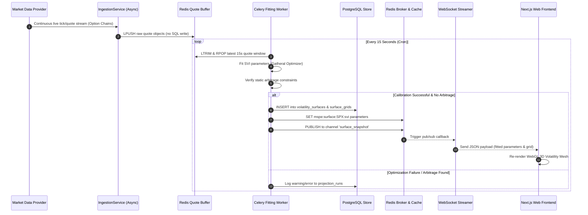
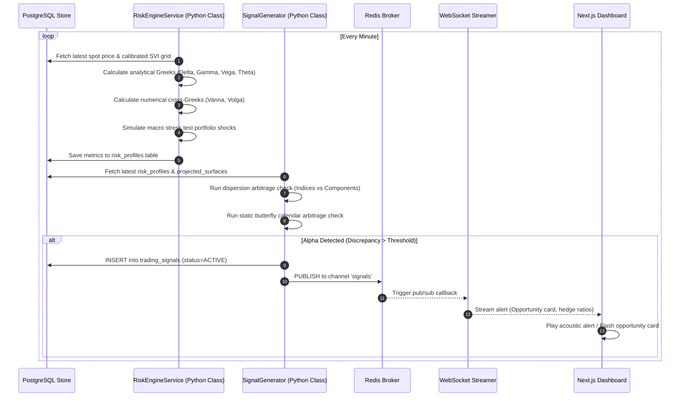

# Data Flow Diagrams & Pipelines

This document details the transaction paths, streaming vectors, and batch boundaries of the **Market Surface Projection Engine (MSPE)**. Visualizing these channels ensures seamless data synchronization between real-time feeds, the database layer, quantitative execution queues, and Next.js clients.

---

## 1. Pipeline 1: Option Quote Ingestion & Real-Time Volatility Surface Fitting

This sequence shows the path from raw tick feeds to real-time WebGL 3D render updates.



---

## 2. Pipeline 2: Probabilistic Surface Projection (ML + Monte Carlo)

This flowchart represents the high-performance process of running long-term surface predictions.

```mermaid
flowchart TD
    subgraph Trigger Phase
        A[API Client POST /api/v1/projections/run] --> B{Validate Request}
        B -->|Invalid| C[Return 420 Bad Request]
        B -->|Valid| D[Create DB Record: status=PENDING]
        D --> E[Dispatch Task to Celery queue: monte_carlo]
        E --> F[Return 202 Accepted to API Client]
    end

    subgraph Prediction Phase (Celery Worker)
        E --> G[Load historical fitted surface grids from DB]
        G --> H[MachineLearningService: Ingest historical features]
        H --> I[PyTorch LSTM: Forecast parameter drift vectors]
    end

    subgraph Simulation Phase (CUDA Node)
        I --> J[Quant Engine: Initialize Heston Stochastic Path Generator]
        J --> K[Generate 100,000 multi-asset simulated spot paths]
        K --> L[Evaluate option joint distribution grids over steps]
        L --> M[Compile percentiles: P10, P50, P90 projected surfaces]
    end

    subgraph Persistence & Notification
        M --> N[Write simulation logs to database: status=COMPLETED]
        M --> O[Write dense projected_surfaces coordinates to DB]
        O --> P[Cache completed status to Redis mspe:jobs:status:id]
        P --> Q[WebSocket Channel: Stream progress complete alert]
    end
```

---

## 3. Pipeline 3: Systematic Signal Generation & Risk Controls

This diagram demonstrates how risk systems validate volatility structures to generate delta-neutral opportunities.


