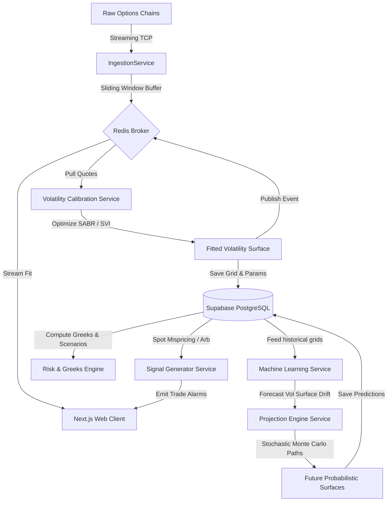

# Market Surface Projection Engine (MSPE) Architecture

Welcome to the comprehensive architecture specifications for the **Market Surface Projection Engine (MSPE)**. This document serves as the master index and conceptual overview for MSPE, a production-grade quantitative finance and algorithmic trading platform.

---

## 1. Architectural Philosophy

MSPE is designed from the ground up to **generate probabilistic future market surfaces** (implied/local volatility surfaces, probability density functions, and yield grids) rather than predicting singular asset price points. 

To achieve this at institutional scale, the system implements:
*   **Strict Decoupling**: Complete mathematical isolation of the quantitative engine in `quant/` from the API, database, and background task frameworks.
*   **Time-Series Scalability**: Declare-partitioned PostgreSQL databases handling option chain ticks without affecting regular transactional tables.
*   **Low-Latency Stream Updates**: Bypassing relational databases for raw tick updates, utilizing Redis buffers, and streaming SVI parameters straight to client browsers.
*   **Resource isolation**: Running resource-intensive Monte Carlo paths on separate worker instances without introducing lag on REST request loops.

---

## 2. Directory Map & Documentation Structure

Explore the architectural specifications of each system tier below:

### 📂 [01. Repository Structure & Folder Hierarchy](file:///c:/Users/vishv/OneDrive/Desktop/MSPE_PR/docs/architecture/01_REPOSITORY_STRUCTURE.md)
Outlines the production-grade Monorepo structure, folder conventions, and code organizational patterns for Frontend, Backend, Quant, and DB migration modules.

### 🗄️ [02. Database Schema & Relational Architecture](file:///c:/Users/vishv/OneDrive/Desktop/MSPE_PR/docs/architecture/02_DATABASE_SCHEMA.md)
Defines PostgreSQL tables, data types, constraints, and composite indices for options quotes, SVI/SABR surface snapshots, model run histories, portfolio Greeks, and trading signals.

### 🔌 [03. API Endpoint & WebSockets Specification](file:///c:/Users/vishv/OneDrive/Desktop/MSPE_PR/docs/architecture/03_API_ARCHITECTURE.md)
Details REST routes, WebSockets connection hooks, Pydantic JSON contracts, and RFC 7807 systematic error responses for live client interfaces.

### ⚙️ [04. Service Architecture & Processing Topology](file:///c:/Users/vishv/OneDrive/Desktop/MSPE_PR/docs/architecture/04_SERVICE_ARCHITECTURE.md)
Presents modular boundaries, Celery execution worker pools, task scheduling priorities (critical, high, medium, low), and Redis caching hierarchies.

### 📐 [05. Class Diagrams & OO Design Specs](file:///c:/Users/vishv/OneDrive/Desktop/MSPE_PR/docs/architecture/05_CLASS_DIAGRAMS.md)
Illustrates mathematical models, simulation algorithms, ML training datasets, and Greeks calculator structures using Mermaid.js class schemas.

### 🔄 [06. Data Flow Diagrams & Pipelines](file:///c:/Users/vishv/OneDrive/Desktop/MSPE_PR/docs/architecture/06_DATA_FLOW_DIAGRAMS.md)
Traces data ingestion streams, SVI parameter optimization routines, dynamic drift projections, and trade signaling sequences.

### ☁️ [07. Deployment Architecture & Cloud Setup](file:///c:/Users/vishv/OneDrive/Desktop/MSPE_PR/docs/architecture/07_DEPLOYMENT_ARCHITECTURE.md)
Maps infrastructure orchestrations across Vercel (Frontend), Railway (FastAPI app & workers), and Supabase (Postgres & pooling).

### 🔑 [08. Environment Variable & Secret Schema](file:///c:/Users/vishv/OneDrive/Desktop/MSPE_PR/docs/architecture/08_ENVIRONMENT_VARIABLES.md)
Templates standard env vars, system validations, and credential rotation security guidelines.

---

## 3. High-Level Core Operations Flow

The dynamic relationships between MSPE services during operation:

